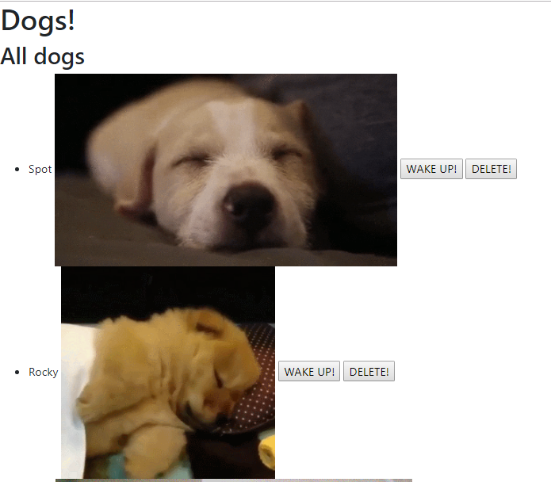

# dogs-app

## Presentation Slides
[Link to google slides](https://docs.google.com/presentation/d/1JD8qXCBsQB4RrjmVpcRj9VVzl0lWYzydTSoZLKXKIxM/edit?usp=sharing){target="_blank"}

## Description
This app is a basic fullstack app that uses MySQL and handlebars to show
sleepy and awake dogs. A form is used to add new dogs. A user can also
delete dogs.

There are several versions to this project as it is meant to reflect the
different stages of implementation.

## Installation
* `git clone git@github.com:f-flores/dogs-app.git`
* `cd dogs-app/version1`
* `npm install`
* Run the contents of `db/schema.sql` and `db/seeds.sql` in MySQL Workbench. This step creates the database and inserts seed data.

## Usage
### Version 01
From the root of the folder, change directory to `version01` by typing
in `cd version01` for a terminal.

Now, run the server by typing in `node ./server.js` and pressing enter.

## Comments
The file `createStructure.sh` does not need to be executed since all the
folders and files are already created. It is just there for studying purposes.
